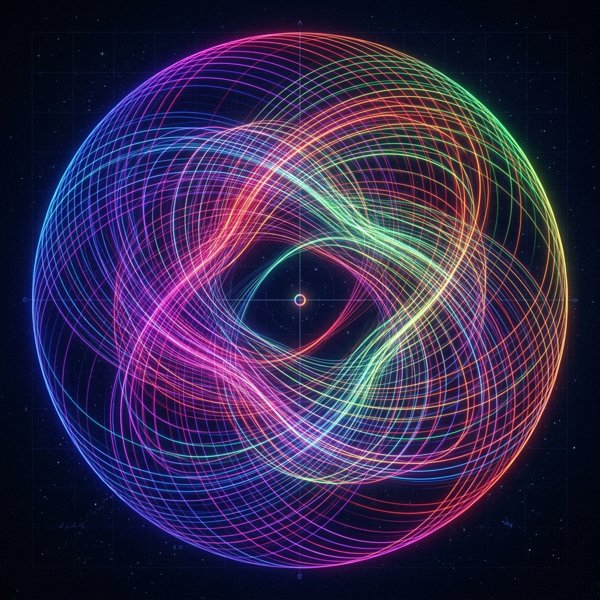

# Nature of Code in Rust 🦀

> Porting Daniel Shiffman's *"The Nature of Code"* examples, simulations, and exercises to Rust using the **Macroquad** game engine. Huge thanks to Daniel for his incredible teaching!

---

## 📂 Project Structure

This project is structured as a single **Cargo Workspace**, sharing a high-performance vector math crate and an interactive simulation runner:

* **`runner/`**: Shared interactive application loop, 2D camera control system, HUD panels, and rendering helpers.
* **`vec_math/`**: Custom `Vector2` library, Perlin Noise wrapper, and zero-GC Quadtree implementation for spatial partitioning.
* **`chapters/`**: Chapter implementation crates:
  * `chapter_0_randomness`: Random walks, probability distributions, Monte Carlo selection, and Perlin noise.
  * `chapter_1_vectors`: Vector math, magnitude, normalization, and Motion 101 dynamics.
  * `chapter_2_forces`: Newton's laws ($F=ma$), friction, drag forces, N-body attraction, and Barnes-Hut Quadtree optimization.
  * `chapter_3_oscillation`: Angles, angular motion, harmonic oscillation, wave dynamics, and Hooke's Law spring physics.

---

## 📊 Progress & Topic Checklist

<details>
<summary><b>Chapter 0: Randomness</b> (<code>-p chapter_0_randomness</code>) — <i>8/8 Complete</i></summary>

- [x] **0.1** Standard 4-way & 8-way Random Walkers
- [x] **0.2** Biased & Rightward Tendency Random Walkers
- [x] **0.3** Uniform Random Distribution Visualization
- [x] **0.4** Gaussian / Normal Distribution Simulation
- [x] **0.5** Custom Accept-Reject (Monte Carlo) Distribution
- [x] **0.6** 1D Perlin Noise Graphing
- [x] **0.7** 2D Perlin Noise Terrain / Smooth Surface Generation
- [x] **0.8** Smooth Perlin Noise Walker

</details>

<details>
<summary><b>Chapter 1: Vectors</b> (<code>-p chapter_1_vectors</code>) — <i>7/7 Complete</i></summary>

- [x] **1.1** Bouncing Ball (Scalar vs. Vector implementation)
- [x] **1.2** Vector Operations (Addition, Subtraction, Multiplication, Division)
- [x] **1.3** Vector Magnitude & Normalization ($\hat{v}$)
- [x] **1.4** Random Unit Vectors & Mouse Direction Vectors
- [x] **1.5** Motion 101: Velocity Integration ($P_{t+1} = P_t + V$)
- [x] **1.6** Motion 101: Acceleration Integration ($V_{t+1} = V_t + A$)
- [x] **1.7** Motion 101: Random & Mouse-Attracted Acceleration

</details>

<details>
<summary><b>Chapter 2: Forces</b> (<code>-p chapter_2_forces</code>) — <i>7/7 Complete</i></summary>

- [x] **2.1** Force Accumulation & Newton's Second Law ($\Sigma F = m a$)
- [x] **2.2** Mass Scaling & Gravity Simulation
- [x] **2.3** Friction Forces ($f = -\mu N \hat{v}$)
- [x] **2.4** Fluid Drag & Resistance ($F_d = -\frac{1}{2}\rho v^2 A C_d \hat{v}$)
- [x] **2.5** Gravitational Attraction (Single Attractor & Two-Body System)
- [x] **2.6** Mutual N-Body Gravitational Attraction
- [x] **2.7** Barnes-Hut $O(N \log N)$ Spatial Quadtree Acceleration

</details>

### Chapter 3: Oscillation (`-p chapter_3_oscillation`)

<details>
<summary><b>3.1 — Angles & Rotation</b></summary>

- [x] Radians & trigonometric vector rotation
- [x] Baton Rotation Simulation (`Example 3.1`)

</details>

<details>
<summary><b>3.2 — Angular Motion</b></summary>

- [x] Angular displacement ($\theta$), velocity ($\omega$), and acceleration ($\alpha$)
- [x] Euler-style angular integration ($\theta_{t+1} = \theta_t + \omega$, $\omega_{t+1} = \omega_t + \alpha$)
- [x] Interactive Mouse Drag, Spin & Damping Baton Simulation (`Exercise 3.2`)
- [x] Force-driven Angular Motion & N-Body Attractor Simulation (`Example 3.2`)
- [x] CannonBall with Spin - impulse force, continuous downward gravity, and initial spin (`Exercise 3.3`)

</details>

<details>
<summary><b>3.3 — Pointing in the Direction of Motion</b></summary>

- [x] Calculating heading orientation angle ($\theta = \text{atan2}(v_y, v_x)$)
- [x] Vehicle acceleration toward target mouse position (`Example 3.3`)
- [x] Interactive Vehicle Steering Simulation with WASD / Arrow Keys (`Exercise 3.4`)

</details>

<details>
<summary><b>3.4 — Polar vs. Cartesian Coordinates</b></summary>

- [x] Polar $(r, \theta)$ to Cartesian $(x, y)$ conversion ($x = r \cdot \cos(\theta)$, $y = r \cdot \sin(\theta)$)
- [x] Interactive Polar to Cartesian simulation (`Example 3.4`)
- [x] Polar Oscillation circular motion (`Example 3.4b`)

</details>

<details>
<summary><b>3.5 — Harmonic Motion & Oscillations</b></summary>

- [x] Sine & Cosine trigonometric functions
- [x] Amplitude, Period, and Frequency ($x = A \cdot \sin(2\pi t / \text{period})$)
- [x] Simple Harmonic Motion (SHM) horizontal oscillation (`Example 3.5`)
- [x] SHM with Angular Velocity (`Example 3.6`)
- [x] Spring Bob simulation using `map()` (`Exercise 3.7`)
- [x] `Oscillator` struct & independent X/Y oscillations (`Example 3.7`)
- [x] Radial Petals: Structured Amplitudes & Phase Offsets (`Exercise 3.8`)
- [x] Accelerating Oscillator & Insect Legs Locomotion (`Exercise 3.9`)

</details>

<details>
<summary><b>3.6 — Waves & Superposition</b></summary>

- [x] Static Sine Wave spatial plot (`Example 3.8`)
- [x] Dynamic Animated Wave simulation with time progression (`Example 3.9`)
- [x] Wavelength ($\lambda$), angular frequency ($\Delta\text{angle}$), & phase shift ($\phi$)
- [x] Additive Waves: Superposition of multiple sinusoidal waves with multi-stop color gradient (`Exercise 3.12`)

</details>

<details>
<summary><b>3.7 — Spring Forces & Dynamics</b></summary>

- [x] Hooke's Law ($F_s = -k x$) (`Example 3.10: A Spring Connection`)
- [x] Spring + Bob physics system (`Bob` & `Spring` domain entities with coiled spring rendering and interactive mouse dragging)
- [x] Gravity + Spring equilibrium physics
- [x] Multiple connected springs & bobs with interactive dragging, anchor toggling, and multi-mode rendering (`Exercise 3.14: Multiple Bobs & Spring Connections`)

</details>

<details open>
<summary><b>3.8 — Pendulums</b></summary>

- [x] Simple Pendulum with angular acceleration, damping, vector visualization, and interactive mouse dragging (`Example 3.11: Swinging Pendulum`)
- [x] Double Pendulum Simulation & Chaotic Trajectory Pattern Trace (`Exercise 3.16: Double Pendulum Simulation`)

  <p align="center">
    
    <br/>
    <em>Chaotic orbit trajectory pattern traced by the secondary bob using Lagrangian mechanics</em>
  </p>

</details>

<details open>
<summary><b>3.9 — Inclined Planes & Normal Force</b></summary>

- [ ] Normal force trigonometry on an incline ($F_N = mg \cos\theta$) (`Exercise 3.16`)
- [ ] Box sliding down an incline with friction ($f = \mu F_N$) (`Exercise 3.17`)

</details>

<details open>
<summary><b>Ecosystem Project</b></summary>

- [ ] Ecosystem Project 4: Creature with internal oscillation driving locomotion / flapping appendages (`The Ecosystem Project`)

</details>


---

## 🚀 Getting Started

Make sure you have [Rust](https://www.rust-lang.org/) installed. 

To run a specific chapter's simulation runner, use Cargo's `-p` flag:

```bash
cargo run -p chapter_0_randomness
cargo run -p chapter_1_vectors
cargo run -p chapter_2_forces
cargo run -p chapter_3_oscillation
```

### 🎮 Interactive Controls

When the simulation window opens, use the built-in runner controls:

* **Left / Right Arrow Keys:** Switch between different examples in the chapter.
* **`r` / Space Key:** Reset the current example state.
* **`h` Key:** Toggle HUD overlay visibility (clean / distraction-free view).

---

## 🛠️ Tech Stack

* **Language:** [Rust (2024 Edition)](https://www.rust-lang.org/)
* **Graphics & Windowing:** [Macroquad](https://macroquad.rs/)
* **Source Material:** [The Nature of Code](https://natureofcode.com/) by Daniel Shiffman
